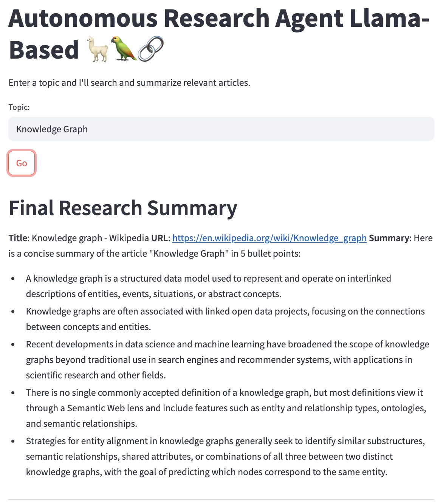
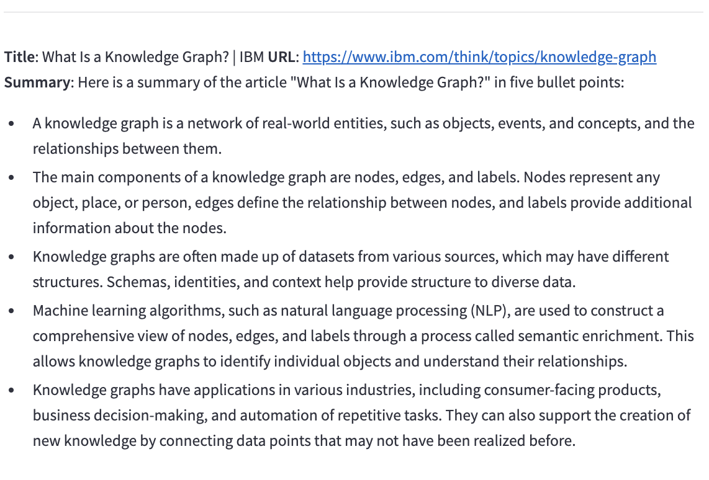
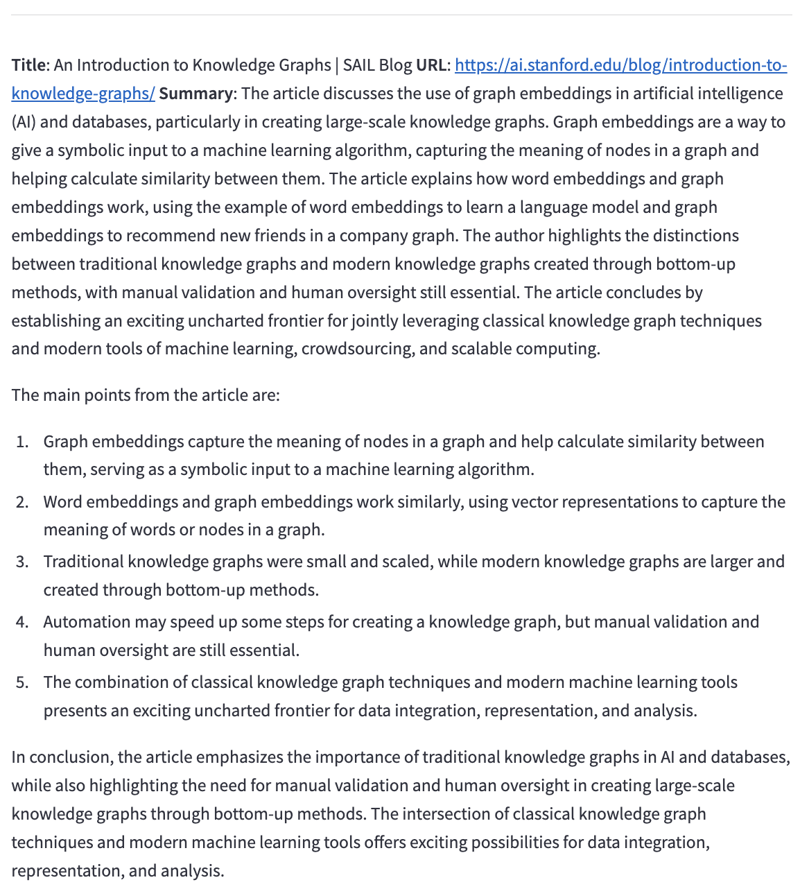

# 🦙 Autonomous Research Agent (Llama2 + DuckDuckGo + LangChain 🦜🔗)

This project is an AI-powered research assistant built with Streamlit, LangChain, Ollama, and DuckDuckGo Search API. It allows users to enter a topic, fetches the top relevant articles, scrapes their content, and provides summarized bullet points using a local Llama2 model.

## 🚀 Features

🔍 Searches the web using DuckDuckGo for the latest articles.

🧠 Uses Llama2 (via Ollama) for intelligent summarization.

📰 Scrapes the article content using BeautifulSoup.

📌 Returns 5-bullet summaries per article.

🖥️ Runs on a clean Streamlit UI for easy interaction.

## 📸 Demo

<p align="center">
  
  
  
</p>

## 🛠️ Installation

### 1. Clone the repository

### 2. Set up a virtual environment (optional but recommended):

```bash
python3 -m venv env
source env/bin/activate  # On Windows: .\env\Scripts\activate
```

### 3. Install dependencies:

```bash
pip install -r requirements.txt
```

### 4. Install and run Ollama:

If you haven't installed Ollama yet, download it here: https://ollama.com/download.
Once installed, open your terminal and run:

```bash
ollama pull llama2
ollama run llama2
```

This pulls and starts the Llama2 model on http://localhost:11434.

5. Run the Stramlit app:

```bash
streamlit run main.py
```

## 📦 Dependencies

streamlit

langchain

langchain_ollama

langchain_core

duckduckgo-search

beautifulsoup4

requests

## 🧠 How It Works

1. User inputs a research topic.

2. The agent uses DuckDuckGo to search for relevant articles.

3. For each top result:

   - The URL is scraped.

   - Content is parsed and cleaned.

   - A system prompt + human prompt is constructed using LangChain.

4. The Llama2 model (via Ollama) processes the prompt and returns a 5-bullet point summary.

5. The results are displayed in the UI.
